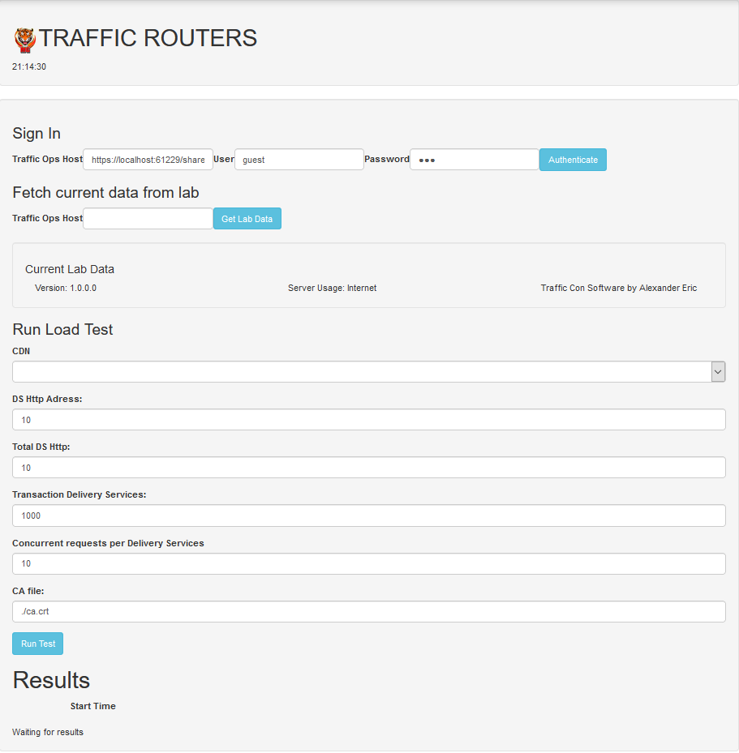
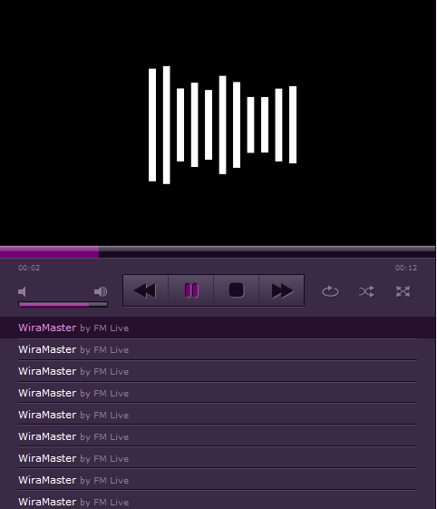
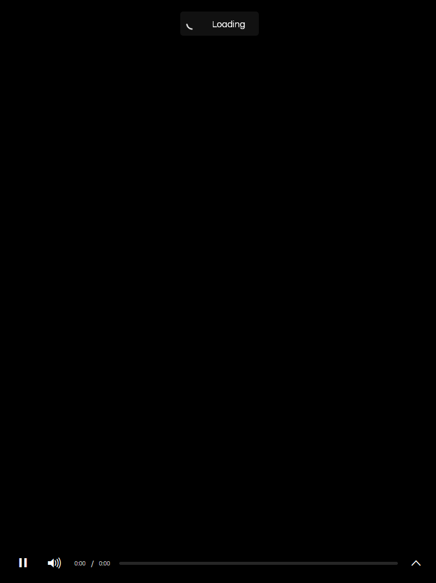

# BrowsX 

    L I C E N S E
    Version 3.0, 18 July 2021
    By Alexander Eric@Eric Lapin
    HARAM HARAM SOFTWARE INC
			   
    TOOLS INFORMATIONS
    * This tools was publish without any Halal Certification 
    * Category of tools: Non Halal Software Development
    * Any Software publish also not baptize from any church,mosque or any prayer place's reverences
    * Sincerely, non-halal software writter: Alexander Eric.
			  

## COPYRIGHT HARAM-HARAM SOFTWARE

    APPENDIX: How to apply the Non-Halal Certificate License to your build.
   
    To apply the Non Halal Software Development License to your work, attach the following
    license file notice, with the fields enclosed by brackets "[]"
    replaced with your own identifying information. (Don't include
    the brackets!)  The text should be enclosed in the appropriate
    comment syntax for the file format. We also recommend that a
    file or class name and description of purpose be included on the
    same "printed page" as the copyright notice for easier
    identification within third-party archives.
    
## MUST READ     
    About
   	1. Demo publish for guideline and researchers.
	2. This is one of technique of building own domains.
	3. Not required 3D Glass Vission for view.
	4. I know this good but the readme things read as 'memes'
	5. This is good opportunity for anyone that want for out from 
	   being host by '.gov', '.com', '.org' and others domains makers.
	   Or if you are boring and thinking about having others domains instead,
	   This guideline, research and demos shall give you some ideas of building more
	   realistic system.
	6. This demo showing better and realistic experiences and ideas for researchers.
	7. This Demo is build, restruct and license by Alexander Eric@Eric Lapin. 
	
	Sincerely
   	ALEXANDER ANAK ERIC@ERIC LAPIN

# ABOUT DEMO
	This Library contain some hint for answers for one of 
	the techniques to build domains and browsers.  Powered by 
	redo archituring using many libraries. 
	Demo build by Alexander Eric. 
	
## OPEN SOURCE GUIDENCES FOR RESEARCHERS
	This open source guideline is as stated, for help open 
	sources researchers for build their own system parcers. 
	This guideline and logic method shortern and provided by 
	Alexander Eric.
	
	BATTERY NOT INLCUDED FOR THIS OPEN SEARCH RESEARCH AND GUIDELINES BY ALEXANDER ERIC.
	
## REFERENCES   	
ContainRef | Link
--------|---------------------------------------------------------
Index | [Index](https://my-mg.github.io/BrowsX/)
Football | [Football](https://my-mg.github.io/BrowsX/football.htm)
Base | [Base](https://my-mg.github.io/BrowsX/maximize.htm)
Interface | [Interface II](https://my-mg.github.io/BrowsX/inbrow.htm)
Design | [Design Ref](https://my-mg.github.io/BrowsX/dsg.html)
Move Bar | [Move Bar](https://my-mg.github.io/BrowsX/movebar.htm)
Error Page | [Error Page](https://my-mg.github.io/BrowsX/LoadGame.htm)
Traffic Router | [Traffic Router](https://my-mg.github.io/BrowsX/Router/) 
Music Player | [Music Player](https://my-mg.github.io/BrowsX/player.htm)
Video Player | [Video Player](https://my-mg.github.io/BrowsX/live/plugin.htm)

# DOMAIN CREATORS AND BROWSERS CREATORS 
------------------------------------------------
## Parser System Method

	Original domain was as at "https://www.11v11.com/teams/malaysia/option/ranking/", 
	But the System shows at sele-hosted and sele-build browsers are showing 
	"https://match.ranking.org.fam" instead of original domain.

	Original domain was as at "https://my-mg.github.io/BrowsX/inbrow.htm", 
	But the System shows at sele-hosted and sele-build browsers are showing 
	"https://project.os.com.alex" instead of original domain. 

# Features
## Router

## Player 

## Video Player

# LICENSE
License by [Alexander Anak Eric@Eric Lapin](https://www.facebook.com/alexandereric.on.fb/)

   	
