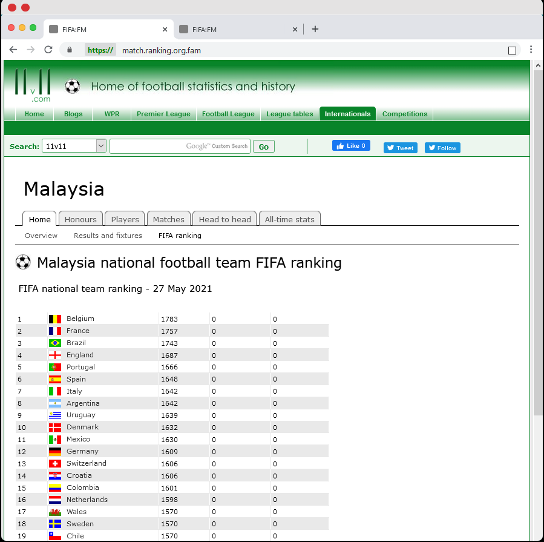
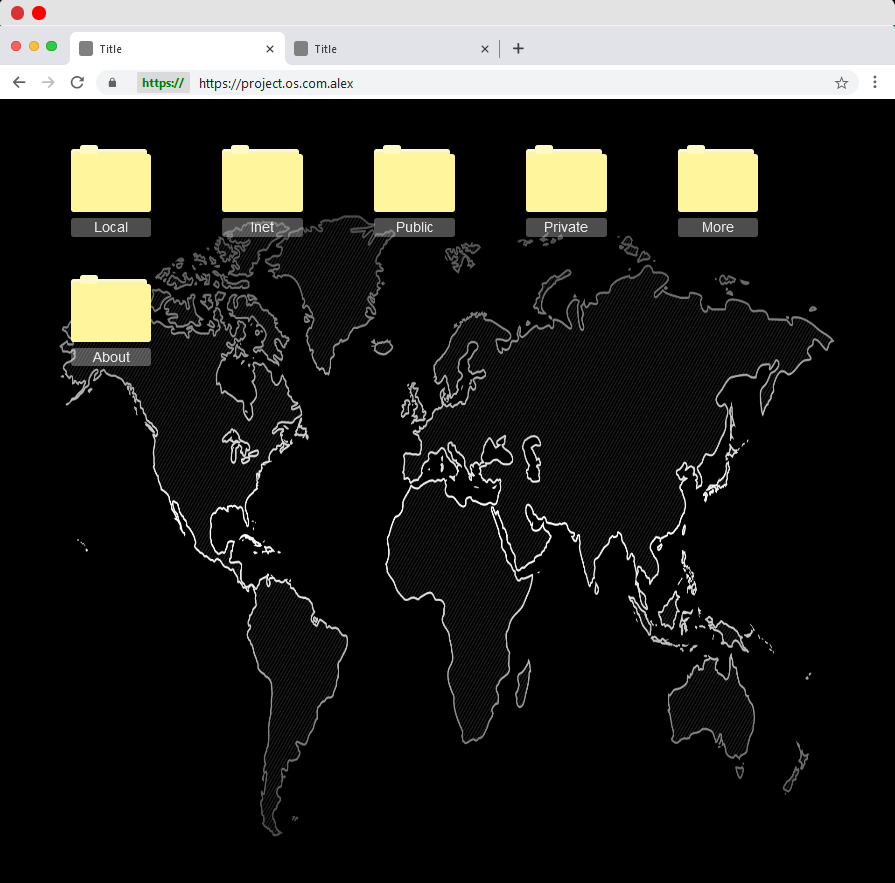

# BrowsX [ABSTRACTION LIBRARY COMPONENT AND SAMPLE]

    L I C E N S E
    Version 2.0, xx February 2021
    By Alexander Eric@Eric Lapin
    HARAM HARAM SOFTWARE INC
			   
    TOOLS INFORMATIONS
    * This tools was publish without any Halal Certification 
    * Category of tools: Non Halal Software Development
    * Any Software publish also not baptize from any church reverence
    * Sincerely, non-halal software writter, Alexander Eric.
			  
    

    

# COPYRIGHT HARAM-HARAM SOFTWARE

    APPENDIX: How to apply the Non-Halal Certificate License to your build.
   
    To apply the Non Halal Software Development License to your work, attach the following
    license file notice, with the fields enclosed by brackets "[]"
    replaced with your own identifying information. (Don't include
    the brackets!)  The text should be enclosed in the appropriate
    comment syntax for the file format. We also recommend that a
    file or class name and description of purpose be included on the
    same "printed page" as the copyright notice for easier
    identification within third-party archives.
    
# MUST READ     
    FACT
   	1. No one care about the license.
   	2. But it just about either you do real copy paste or not.
   	3. Dont Really Care.
   	4. Using Library, build something.
   	5. Or you may build your own languages and format.
   	6. Fact, we dont really care.
   	7. If you think we care, read the above statement.

	Sincerely
   	ALEXANDER ANAK ERIC@ERIC LAPIN
	
## REFERENCES   	
ContainRef | Link
--------|---------------------------------------------------------
Index | [Index](https://my-mg.github.io/BrowsX/)
Football | [Football](https://my-mg.github.io/BrowsX/football.htm)
Base | [Base](https://my-mg.github.io/BrowsX/maximize.htm)
Interface | [Interface II](https://my-mg.github.io/BrowsX/inbrow.htm)
Design | [Design Ref](https://my-mg.github.io/BrowsX/dsg.html)
Move Bar | [Move Bar](https://my-mg.github.io/BrowsX/movebar.htm)
Error Page | [Error Page](https://my-mg.github.io/BrowsX/LoadGame.htm)

#LICENSE
License by [Alexander Anak Eric@Eric Lapin](https://www.facebook.com/alexandereric.on.fb/)

   	
